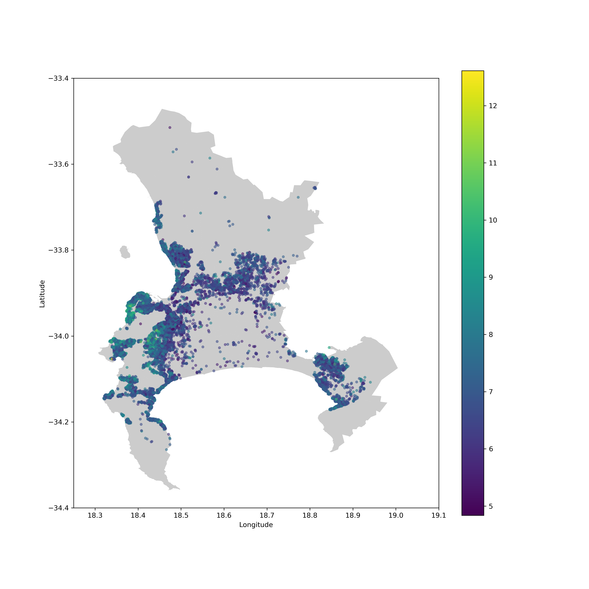

# CapeTown-AirBnB-PricePrediction
Investigation into spatial and textual features influencing AirBnB price in Cape Town.

  

 

## Data
The Cape Town AirBnB dataset was obtained from _Inside AirBnB_, a compiled set of publicly available and verified AirBnB data spanning multiple cities. The focus of the investigation was narrowed to the month of December 2019
in order to analyse the contribution of individual features without the influence of temporal and seasonal changes. The December 2019 dataset comprises 24458 samples and 106 features including textual, continuous, categorical and spatial attributes regarding both the venue and the host.

## Objectives
The overall objective was to to determine the extent to which spatial and geographical features influence the AirBnB price distribution in Cape Town. Three central research questions were explored.

### 1. Determining the most pertinent features influencing price
What are the most significant factors impacting the AirBnB price distribution in Cape Town?

### 2. Finding the optimal model
Which machine learning model is most effective for AirBnB price prediction?

### 3. Investigating the role of spatial features
To what extent do spatial features play a significiant role in influencing the price of an AirBnB listing and can novel spatial features significantly boost performance?

## Results

## Report
<a href="AirBnB Price Prediction Report.pdf">
Investigating the Impact of Spatial Features on AirBnB Price Prediction in Cape Town
