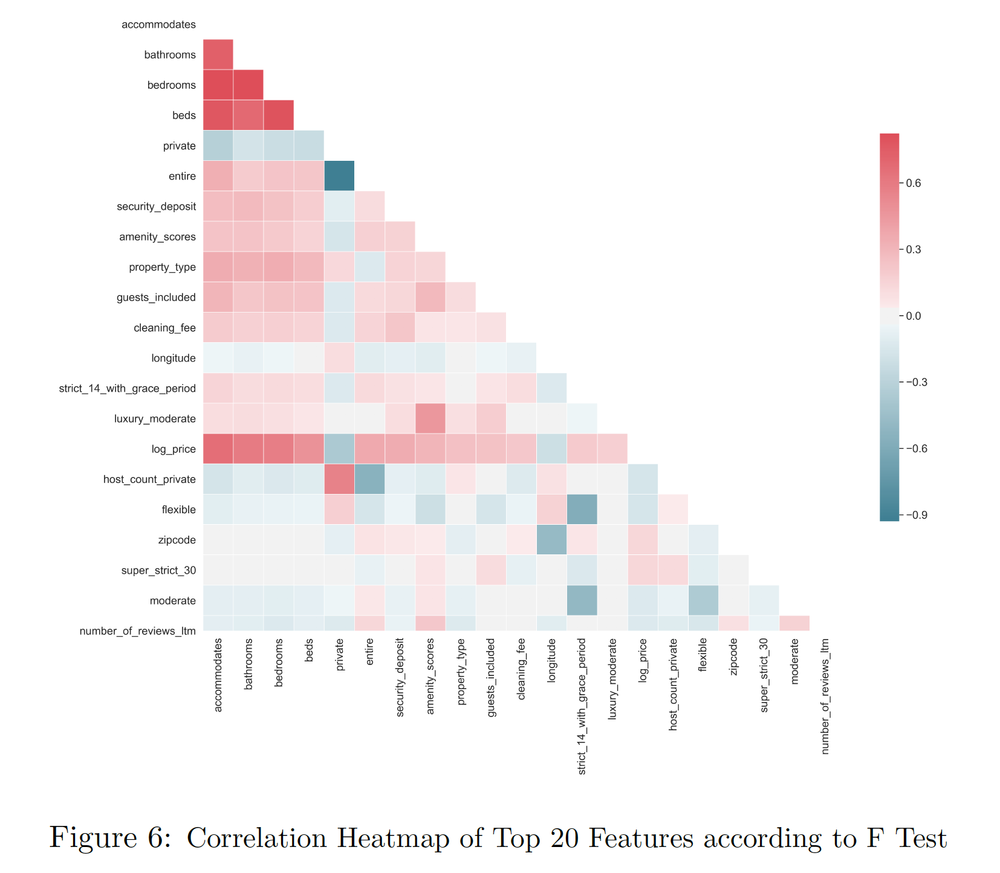
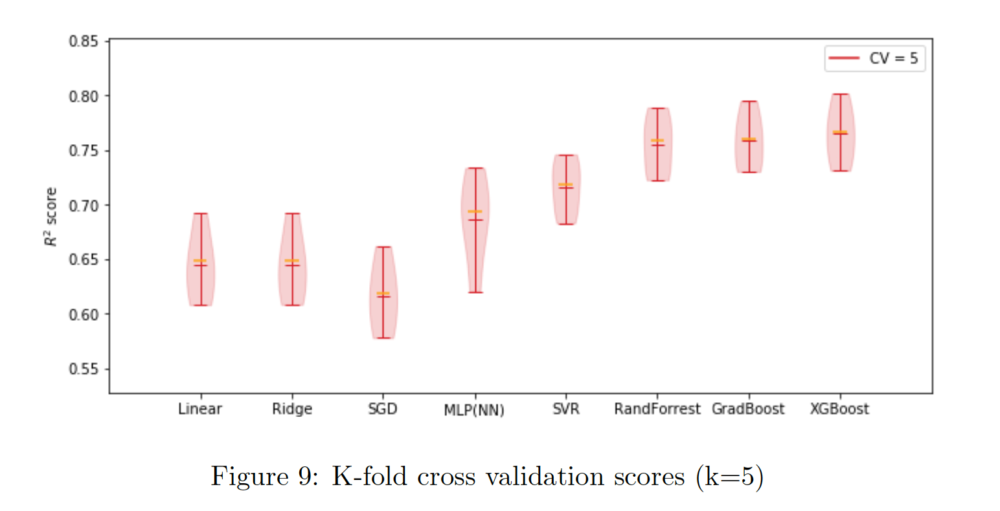

# CapeTown-AirBnB-PricePrediction
Investigation into spatial and textual features influencing AirBnB price in Cape Town.

  

## Data
The Cape Town AirBnB dataset was obtained from _Inside AirBnB_, a compiled set of publicly available and verified AirBnB data spanning multiple cities. The focus of the investigation was narrowed to the month of December 2019
in order to analyse the contribution of individual features without the influence of temporal and seasonal changes. The December 2019 dataset comprises 24458 samples and 106 features including textual, continuous, categorical and spatial attributes regarding both the venue and the host.

## Objectives
The overall objective was to to determine the extent to which spatial and geographical features influence the AirBnB price distribution in Cape Town. Three central research questions were explored.

### 1. Determining the most pertinent features influencing price
What are the most significant factors impacting the AirBnB price distribution in Cape Town?

### 2. Finding the optimal model
Which machine learning model is most effective for AirBnB price prediction?

### 3. Investigating the role of spatial features
To what extent do spatial features play a significiant role in influencing the price of an AirBnB listing and can novel spatial features significantly boost performance?

## Novel Spatial Features

- Neighbourhood Demographics
- Supply and Demand
- Geocoding

## Results

### 1. Most influential features
Through analysis of the continuous, categorical and textual features present in the dataset, it was concluded that accommodation characteristics such as number of _guests_, _bathrooms_ and _bedrooms_ have the greatest impact on price. As an overall feature group, continuous features exhibit the most predictive power.

  

However a more notable result is the ability of the categorical and textual features to provide significant value as meaning has to be extracted from the data through chosen techniques. This substantial performance highlights the value of textual processing techniques such as _term frequency inverse document
frequency (tf-idf )_ and _Truncated Single Value Decomposition_ when extracting useful features from raw text.

### 2. Optimal model
The results exhibited a clear indication in favour of Ensemble methods such as _XGBoost_, _GradBoost_ and _Random Forest_. Moreover, the superior performance of Boost methods over the neural network in particular suggests that Boost algorithms are better able to perform on smaller or limited datasets. Therefore a key conclusion is that Boost methods are more suitable for complex price prediction with modest datasets.

  

### 3. Spatial attributes
Spatial features were found to have a significant impact on predictive importance, with _longitude_ playing the central role. However, a limitation of the analysis was the relatively low number of spatial features generated in comparison to other feature groups.

## Report
<a href="AirBnB Price Prediction Report.pdf">
Investigating the Impact of Spatial Features on AirBnB Price Prediction in Cape Town
